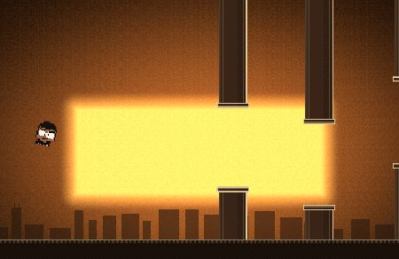
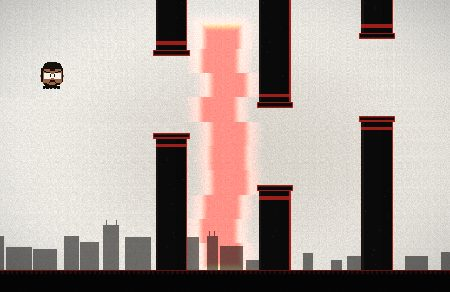
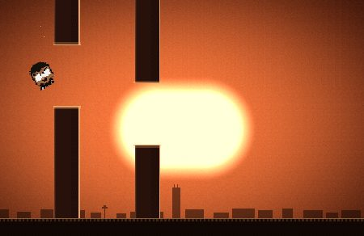

# FLAPPY KANYE — SEVEN ERAS

> Flappy Bird, staged as a James Turrell light installation, scored to Kanye's discography.
> One continuous run. Seven rooms of light. No features.

**▶ Play: https://tdeschamps.github.io/flappykanye/**

| The College Dropout | Yeezus | The Life of Pablo |
|:---:|:---:|:---:|
|  |  |  |

## The journey

You fly through Kanye's discography in one continuous run. Every 7 points the room
rebuilds itself around you — palette, light, physics, obstacles, and music all change.
The skyline below travels from Chicago to LA as you go.

| Era | Room (after Turrell) | The twist |
|---|---|---|
| I · The College Dropout (2004) | Warm sepia Skyspace | The on-ramp — wide gaps, pinstriped monoliths |
| II · Late Reg / Graduation (2007) | Candy Ganzfeld | Monoliths bob on a slow sine |
| III · 808s & Heartbreak (2008) | A crimson slot in cold darkness | Gaps breathe with the audible heartbeat |
| IV · MBDTF (2010) | Molten gold portal in oxblood | Gilded gaps drift while they cross |
| V · Yeezus (2013) | The inverted room — bone white, black slabs, red tape | Draw-only glitch jitter; the room tears |
| VI · TLOP / Ye (2016) | Peach dawn Skyspace | Gap placement rides a melody — high, low, high |
| VII · Donda (2021) | Total darkness, one orb | Monoliths reveal themselves only as they approach |

Survive all seven and **GOAT mode** begins: everything gold, faster and tighter each lap,
the music transposed up a semitone per lap.

## Maximum Kanye

- **Ego meter** — clean passes inflate his head. Full ego doubles your score until it deflates.
- **Era death quotes** — every death gets an album-appropriate epitaph. *"— YE, PROBABLY."*
- **"I'MA LET YOU FINISH…"** — beating your best score interrupts the game in slow motion.
- **Yeezus takeovers** — the room, the HUD, and your score glitch (photosensitivity-safe, respects `prefers-reduced-motion`).

## The sound

Everything is synthesized in the browser with the Web Audio API — zero samples, zero audio files.
Each era's track is anchored in that album's production: chipmunk-soul chops over swung boom-bap,
stadium synths on four-on-the-floor, a TR-808 heartbeat with autotune glides, maximalist
strings and tribal toms, an industrial drone under a Black-Skinhead gallop, gospel organ and
claps, and a void liturgy of organ and one enormous 808 per bar.

## Controls

- **Tap / Space / ↑** — flap
- **M** — mute
- Add `?debug` to the URL for era-jump keys (**1–7**, **G** for GOAT mode)

## Run locally

No build, no dependencies. ES modules need a server:

```
python3 -m http.server 8000
# → http://localhost:8000
```

## How it's made

Vanilla JavaScript, zero dependencies. The room is a single WebGL1 fragment shader
(volumetric light field, signed-distance aperture, bloom, film grain, chromatic
aberration) rendered smooth and full-resolution — while everything living inside it
(the pixel-sprite Kanye, monoliths, city, particles) is drawn on a 240p canvas and
upscaled with nearest-neighbor. A hi-bit split: crunchy sprites floating in pure light.
Music runs on a 16-step lookahead scheduler; beds are pure data.

## Credits & disclaimers

A fan-made parody game. Not affiliated with, endorsed by, or connected to Ye (Kanye West)
or the James Turrell studio. All "quotes" are invented parody. All music is original
synthesis evoking production styles — no samples used.

Pixel font: [Press Start 2P](https://fonts.google.com/specimen/Press+Start+2P) by
CodeMan38 (SIL Open Font License 1.1).

Built with [Claude Code](https://claude.com/claude-code).
